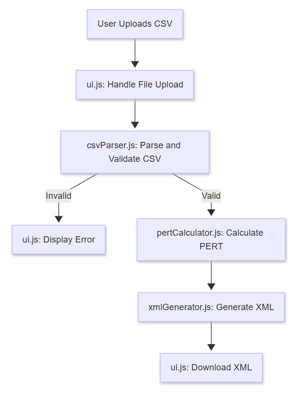

# Design Document for CSV2PERT Web Application

This document provides a detailed design for the `CSV2PERT` web application, which processes a CSV file containing project task data, performs PERT calculations, and generates an mxGraph XML file for draw.io integration. The design emphasizes separation of concerns, modularity, and best practices.

---

## 1. Overview

The `CSV2PERT` web application is a browser-based tool that:
- Accepts a CSV file with task data (task ID, optimistic, most likely, pessimistic times, and dependencies).
- Performs PERT (Program Evaluation and Review Technique) calculations.
- Generates an mxGraph XML file for visualizing the PERT diagram in draw.io.

### Key Features
- **CSV Parsing**: Extracts task data from a user-uploaded CSV file.
- **PERT Calculations**: Computes expected time, variance, critical path, and scheduling metrics.
- **Graph Generation**: Creates a directed acyclic graph (DAG) of tasks and dependencies.
- **XML Output**: Produces mxGraph XML with styled nodes and edges for draw.io.

---

## 2. Separation of Concerns

The application is divided into four main modules, each handling a distinct responsibility:

1. **UI Module**: Manages user interactions and orchestrates the workflow.
2. **CSV Parser Module**: Parses and validates the CSV input.
3. **PERT Calculator Module**: Handles graph construction and PERT calculations.
4. **XML Generator Module**: Generates the mxGraph XML output.

This modular approach ensures maintainability and scalability.

---

## 3. Code Structure

The application is organized into multiple files, splitting the functionality from a single `index.html` into separate JavaScript modules:

- **`index.html`**: The entry point with UI elements and script imports.
- **`ui.js`**: Coordinates user interactions and module calls.
- **`csvParser.js`**: Parses and validates CSV data.
- **`pertCalculator.js`**: Builds the graph and performs PERT calculations.
- **`xmlGenerator.js`**: Generates the mxGraph XML.
- **`styles.css`**: (Optional) Styles the UI.

### File Responsibilities

- **`index.html`**:
  - Contains a file input, a generate button, and a message div.
  - Loads external libraries (PapaParse for CSV parsing, graphlib for graph operations) and the JavaScript modules.

- **`ui.js`**:
  - Listens for file uploads and button clicks.
  - Calls `csvParser.parseCSV()` to process the CSV.
  - Passes parsed data to `pertCalculator.calculatePERT()`.
  - Uses the results to call `xmlGenerator.generateXML()` and initiate the download.

- **`csvParser.js`**:
  - Uses PapaParse to parse the CSV file.
  - Validates required columns (`task_id`, `o`, `m`, `p`, `dependencies`) and data integrity.
  - Returns an array of task objects or an error message.

- **`pertCalculator.js`**:
  - Constructs a DAG using graphlib.
  - Performs topological sorting and PERT calculations (e.g., expected time, slack, critical path).
  - Returns the graph and calculated data.

- **`xmlGenerator.js`**:
  - Converts the graph and PERT data into mxGraph XML.
  - Applies styling and labels (e.g., critical path in red).
  - Returns the XML string.

---

## 4. Data Flow

The data flows through the application as follows:

1. **User Action**: The user uploads a CSV file via the file input in `index.html`.
2. **UI Processing**: `ui.js` captures the file and sends it to `csvParser.parseCSV()`.
3. **CSV Parsing**: `csvParser.js` parses the CSV, validates it, and returns an array of task objects (or an error).
4. **PERT Calculation**: `ui.js` passes the task array to `pertCalculator.calculatePERT()`, which builds the graph and computes PERT metrics.
5. **XML Generation**: `ui.js` sends the results to `xmlGenerator.generateXML()`, which produces the mxGraph XML string.
6. **Output**: `ui.js` triggers the download of the XML file.



---

## 5. Module Details

### 5.1 UI Module (`ui.js`)
- **Purpose**: Manages user interaction and workflow.
- **Key Functions**:
  - `handleFileUpload(file)`: Sends the file to `csvParser.parseCSV()`.
  - `handleGenerateClick()`: Coordinates calls to `pertCalculator` and `xmlGenerator`.
  - `downloadXML(xmlString)`: Creates a downloadable XML file.

### 5.2 CSV Parser Module (`csvParser.js`)
- **Purpose**: Extracts and validates data from the CSV.
- **Key Functions**:
  - `parseCSV(file)`: Returns an array of task objects with properties: `id`, `o`, `m`, `p`, `dependencies`.
- **Validation**: Ensures required columns exist and data types are correct (e.g., numbers for `o`, `m`, `p`).

### 5.3 PERT Calculator Module (`pertCalculator.js`)
- **Purpose**: Builds the task graph and computes PERT metrics.
- **Key Functions**:
  - `calculatePERT(tasks)`: Returns an object with the graph, PERT data (TE, slack, etc.), and critical path.
- **Steps**:
  - Builds a DAG with tasks as nodes and dependencies as edges.
  - Performs topological sort.
  - Calculates forward pass (Early Start/Finish), backward pass (Late Start/Finish), and slack.

### 5.4 XML Generator Module (`xmlGenerator.js`)
- **Purpose**: Converts PERT data into mxGraph XML.
- **Key Functions**:
  - `generateXML(graph, pertData)`: Returns the XML string.
- **Features**:
  - Styles nodes (e.g., red for critical path).
  - Adds labels with PERT metrics.

---

## 6. Data Extraction and Calculations

### 6.1 CSV Data Extraction
- **Input**: CSV with columns: `task_id`, `o` (optimistic), `m` (most likely), `p` (pessimistic), `dependencies` (comma-separated task IDs).
- **Output**: Array of objects:
  ```json
  [
    { "id": "A", "o": 1, "m": 4, "p": 7, "dependencies": [] },
    { "id": "B", "o": 2, "m": 5, "p": 8, "dependencies": ["A"] }
  ]
  ```
- **Location**: Handled in `csvParser.js`.

### 6.2 PERT Calculations
- **Location**: Performed in `pertCalculator.js`.
- **Formulas**:
  - Expected Time (TE) = `(o + 4m + p) / 6`
  - Variance = `((p - o) / 6)^2`
  - Early Start (ES), Early Finish (EF): Forward pass through the DAG.
  - Late Start (LS), Late Finish (LF): Backward pass through the DAG.
  - Slack = `LS - ES`
  - Critical Path: Tasks with `slack == 0`.
- **Output**: Graph object and PERT metrics.

### 6.3 mxGraph XML Derivation
- **Location**: Generated in `xmlGenerator.js`.
- **Process**:
  - Maps tasks to `<mxCell>` nodes with PERT data in labels.
  - Maps dependencies to `<mxCell>` edges.
  - Applies styles (e.g., `fillColor=#ff0000` for critical path).
- **Sample Output**:
  ```xml
  <mxGraphModel>
    <root>
      <mxCell id="0"/>
      <mxCell id="1" parent="0"/>
      <mxCell id="A" value="A<br>TE=4.00<br>Slack=0.00" style="shape=rectangle;fillColor=#ff0000;html=1" vertex="1" parent="1">
        <mxGeometry x="100" y="100" width="80" height="40"/>
      </mxCell>
      <mxCell id="B" value="B<br>TE=5.00<br>Slack=1.00" style="shape=rectangle;fillColor=#ffffff;html=1" vertex="1" parent="1">
        <mxGeometry x="200" y="100" width="80" height="40"/>
      </mxCell>
      <mxCell id="edge1" source="A" target="B" style="endArrow=classic;html=1" edge="1" parent="1"/>
    </root>
  </mxGraphModel>
  ```

---

## 7. Best Practices
- **Modularity**: Separate files for each concern.
- **Validation**: Early CSV validation to catch errors.
- **Error Handling**: User-friendly messages in the UI.
- **Performance**: Efficient graph operations for scalability.

---

## 8. Conclusion
This design splits `index.html` into logical modules, outlines the data flow from CSV to XML, and details where data extraction, calculations, and XML generation occur. The included diagrams illustrate the process, ensuring a clear implementation path.